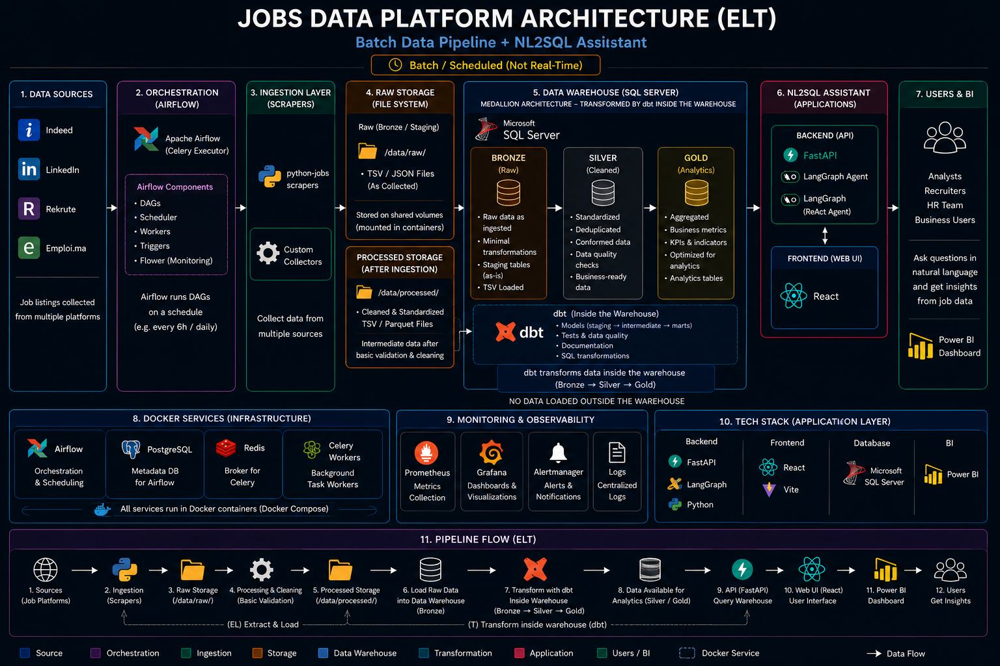
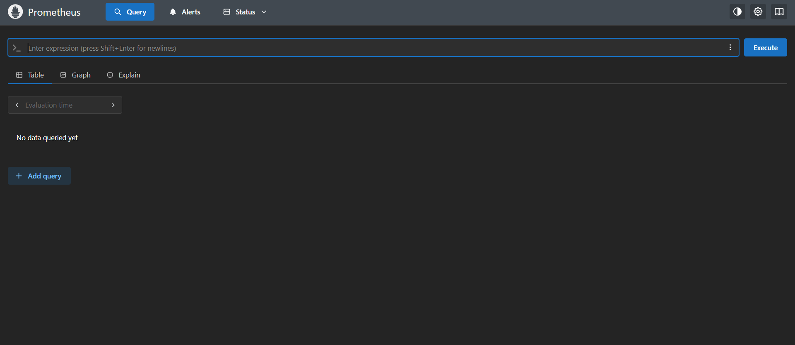
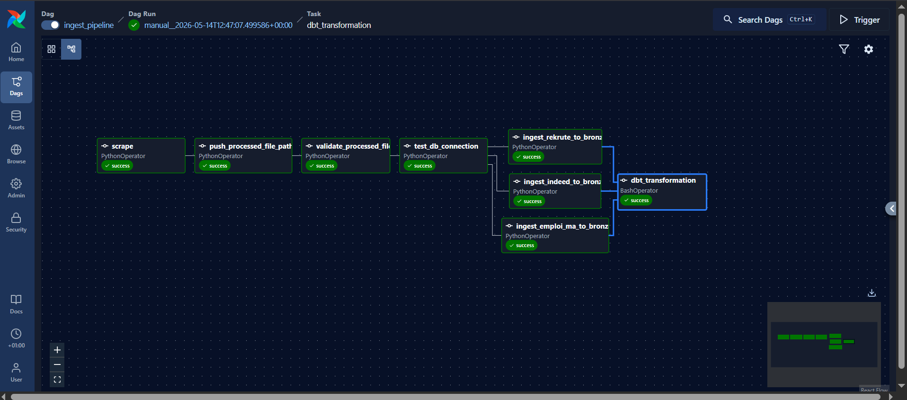
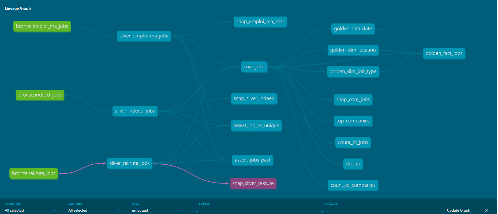
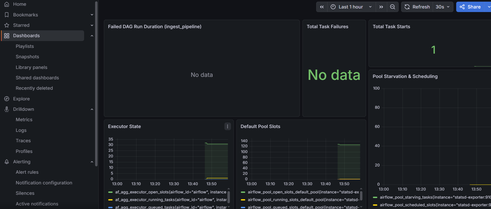

# Jobs Data Warehouse Project

An end-to-end modern **Data Engineering Platform** that collects job listings from multiple online sources, processes and standardizes the data using an **ELT architecture**, and transforms it into a scalable **Medallion Data Warehouse** using **Apache Airflow**, **dbt**, and **Microsoft SQL Server**.

The platform also provides:
- 📊 Business Intelligence dashboards with **Power BI**
- 🤖 An **NL2SQL AI Assistant** powered by **FastAPI + LangGraph**
- 📈 Full pipeline monitoring using **Prometheus**, **StatsD**, and **Grafana**
- 🐳 Fully containerized infrastructure with **Docker Compose**

---

# 🚀 Project Overview

This project automates the collection, processing, transformation, and analysis of job market data from multiple recruitment platforms.

The architecture follows a **Batch ELT (Extract → Load → Transform)** approach:

1. **Extract**
   - Scrape job data from multiple platforms using Python scrapers.

2. **Load**
   - Store raw and processed files locally.
   - Load cleaned data into the **Bronze layer** of SQL Server.

3. **Transform**
   - Use **dbt** to transform data **inside the warehouse**:
     - Bronze → Silver
     - Silver → Core
     - Core → Gold

4. **Serve**
   - Expose analytics through:
     - Power BI dashboards
     - NL2SQL AI Assistant

---

# 🏗️ Complete Architecture


## High-Level Architecture

```text
DATA SOURCES
    ↓
AIRFLOW ORCHESTRATION (Docker)
    ↓
INGESTION LAYER
    ↓
RAW STORAGE + PROCESSED STORAGE
    ↓
MS SQL SERVER DATA WAREHOUSE
(BRONZE → SILVER → CORE → GOLD)
    ↓
dbt TRANSFORMATIONS INSIDE WAREHOUSE
    ↓
POWER BI + NL2SQL ASSISTANT
    ↓
END USERS
```

---

# 🧱 Medallion Architecture

## 🥉 Bronze Layer
Raw ingested data loaded from processed TSV files into SQL Server.

## 🥈 Silver Layer
Standardized and cleaned data using dbt models.

## ⚙️ Core Layer
Integrated and deduplicated business-ready job dataset.

## 🥇 Gold Layer
Analytics-ready Star Schema optimized for BI and querying.

---

# ⚙️ Technology Stack

| Layer | Technologies |
|---|---|
| Orchestration | Apache Airflow |
| Execution | CeleryExecutor |
| Messaging | Redis |
| Metadata DB | PostgreSQL |
| Warehouse | Microsoft SQL Server |
| Transformation | dbt |
| Scraping | Python + JobSpy |
| Backend API | FastAPI |
| AI Layer | LangGraph + Gemini/Ollama |
| Frontend | React + Vite + Tailwind |
| Monitoring | Prometheus + Grafana + StatsD |
| Containerization | Docker + Docker Compose |
| BI | Power BI |

---

# 🐳 Docker Infrastructure

## Docker Services

| Service | Role |
|---|---|
| Airflow API Server | Airflow Web UI |
| Airflow Scheduler | DAG scheduling |
| Airflow Worker | Task execution |
| Airflow Triggerer | Deferred task handling |
| Airflow DAG Processor | DAG parsing |
| Airflow Init | Initialization & migrations |
| PostgreSQL | Airflow metadata database |
| Redis | Celery broker |
| Flower | Celery monitoring |
| Prometheus | Metrics collection |
| Grafana | Dashboards & visualization |
| StatsD Exporter | Airflow metrics exporter |
| dbt-docs | dbt documentation server |

---

# 📂 Project Structure

```text
project-root/
│
├── config/
├── dags/
├── data/
│   ├── raw/
│   └── processed/
├── dbt/
│   ├── models/
│   │   ├── silver/
│   │   ├── core/
│   │   └── gold/
├── docker/
├── docs/
│   ├── architecture/
│   ├── screenshots/
│   │   ├── airflow/
│   │   ├── grafana/
│   │   ├── prometheus/
│   │   ├── dbt/
│   │   └── powerbi/
├── notebooks/
├── scripts/
├── src/
└── requirements-docker.txt
```

---

# 🔄 Airflow Data Pipeline

## Main DAG File

```text
dags/ingest_pipeline.py
```

## Pipeline Flow

```text
1. Scrape Job Data
2. Save Raw TSV Files
3. Clean & Validate Data
4. Save Processed Files
5. Load into Bronze Layer
6. Run dbt Build
7. Bronze → Silver → Core → Gold
8. Update Dashboards & APIs
```

---

# 🔧 dbt Transformations

## dbt Project Path

```text
dbt/
```

## dbt Documentation

### Generate Docs

```bash
dbt docs generate
```

### Serve Docs

```bash
dbt docs serve
```

### Access URL

```text
http://localhost:8082
```

---

## Prometheus




## Airflow Screenshots



---

## dbt Documentation Screenshots



---

## Grafana Dashboard Screenshots



---

## Power BI Dashboard Screenshots

```text
docs/screenshots/powerbi/
```

---

# 🤖 NL2SQL Assistant

## Backend Stack
- FastAPI
- LangGraph
- LangChain
- Gemini / Ollama

## Frontend Stack
- React
- Vite
- TailwindCSS

## Features
- Natural Language → SQL
- SQL Execution
- Anti-Hallucination
- Interactive Results

---

# 📈 Power BI Dashboard

The Gold layer feeds Power BI dashboards for:
- Hiring trends
- Top companies
- Skill demand analysis
- Job distribution
- Remote vs onsite analysis

---

# 🚦 Getting Started

## 1. Create `.env`

```env
FERNET_KEY=your_key
AIRFLOW_UID=50000
SQL_SERVER_URL=your_sql_server_url
GOOGLE_API_KEY=your_api_key
```

---

## 2. Start Platform

```bash
docker-compose -f docker/docker-compose.yaml up --build
```

---

## 3. Access Services

| Service | URL |
|---|---|
| Airflow | http://localhost:8080 |
| Grafana | http://localhost:3000 |
| Prometheus | http://localhost:9090 |
| dbt Docs | http://localhost:8082 |
| Flower | http://localhost:5555 |

---

# 📌 Key Architectural Principles

- ELT Architecture
- Batch Processing (Not Real-Time)
- Medallion Data Warehouse
- dbt transforms data inside SQL Server
- Fully containerized infrastructure
- Analytics-ready Gold layer

---

# 👥 End Users

- Data Analysts
- Recruiters
- HR Teams
- Business Users
- BI Teams
- Data Engineers

---

# 📜 License

Licensed under the Apache License 2.0.
